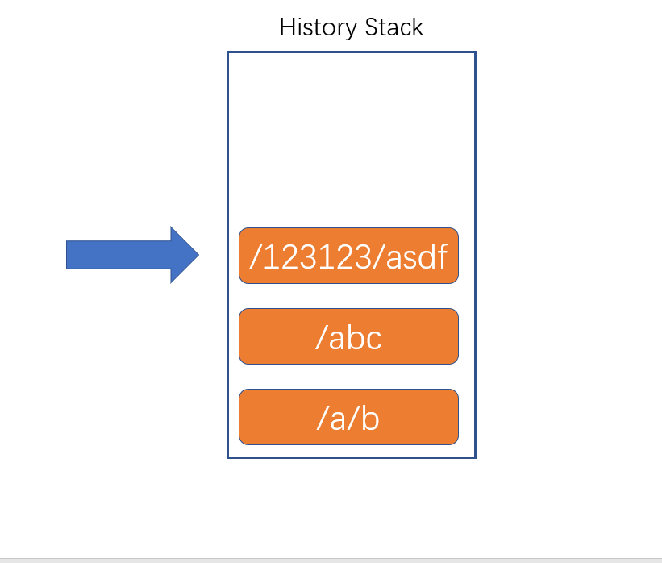

# 1-1 React概述

> 官网：https://react.docschina.org/

## 什么是React？

React是由**Facebook**研发的、用于**解决UI复杂度**的开源**JavaScript库**，目前由React联合社区维护。

> 它不是框架，只是为了解决UI复杂度而诞生的一个库

## React的特点

- 轻量：React的开发版所有源码（包含注释）仅3000多行
- 原生：所有的React的代码都是用原生JS书写而成的，不依赖其他任何库
- 易扩展：React对代码的封装程度较低，也没有过多的使用魔法，所以React中的很多功能都可以扩展。
- 不依赖宿主环境：React只依赖原生JS语言，不依赖任何其他东西，包括运行环境。因此，它可以被轻松的移植到浏览器、桌面应用、移动端。
- 渐近式：React并非框架，对整个工程没有强制约束力。这对与那些已存在的工程，可以逐步的将其改造为React，而不需要全盘重写。
- 单向数据流：所有的数据自顶而下的流动
- 用JS代码声明界面
- 组件化

## 对比Vue

|   对比项   |  Vue  | React |
| :--------: | :---: | :---: |
| 全球使用量 |       |   ✔   |
| 国内使用量 |   ✔   |       |
|    性能    |   ✔   |   ✔   |
|   易上手   |   ✔   |       |
|   灵活度   |       |   ✔   |
|  大型企业  |       |   ✔   |
| 中小型企业 |   ✔   |       |
|    生态    |       |   ✔   |

## 学习路径

整体原则：熟悉API --> 深入理解原理

1. React
   1. 基础：掌握React的基本使用方法，有能力制作各种组件，并理解其基本运作原理
   2. 进阶：掌握React中的一些黑科技，提高代码质量
2. React-Router：相当于vue-router
3. Redux：相当于Vuex
   1. Redux本身
   2. 各种中间件
4. 第三方脚手架：umi
5. UI库：Ant Design，相当于Vue的Element-UI 或 IView
6. 源码部分
   1. React源码分析
   2. Redux源码分析

## 关于课程

- demo关键字：课程名称前有**demo**字样的，为一个小练习，需要同学听完讲解后自行独立完成
- 扩展关键字：课程名称前有**扩展**字样的，为选修内容，没有掌握不会影响后面的学习
- 关于源代码：本门课所有源代码均使用git管理，每节课的代码为独立分支，但某些文件夹和文件不属于源代码管理范畴。
- 关于npm：本门课所有的第三方库安装，均使用yarn

***
# 1-2 Hello World

直接在页面上使用React，引用下面的JS

```html
<!-- reace的核心库 与宿主环境无关 -->
<script crossorigin src="https://unpkg.com/react@16/umd/react.development.js"></script>
<!-- 依赖核心库 将核心的功能与页面结合 -->
<script crossorigin src="https://unpkg.com/react-dom@16/umd/react-dom.development.js"></script>
<script src="https://unpkg.com/babel-standalone@6/babel.min.js"></script>
```

## React.createElement

创建一个React元素，称作虚拟DOM，本质上是一个对象

1. 参数1：元素类型，如果是字符串，一个普通的HTML元素
2. 参数2：元素的属性，一个对象
3. 后续参数：元素的子节点

## JSX

JS的扩展语法，需要使用babel进行转义。

***

# 命令补充
[npx 使用教程](http://www.ruanyifeng.com/blog/2019/02/npx.html)
[npm init vite-app 是什么意思？](https://blog.csdn.net/qq_21744873/article/details/108831306)
[你不知道的 npm init](https://www.cnblogs.com/moqiutao/p/9990458.html)
npx create-react-app my-app
npm init react-app my-app
cnpm init react-app my-app
yarn init react-app my-app

# 1-3 使用脚手架搭建工程

官方：create-react-app
第三方：next.js、umijs

凡是使用JSX的文件，必须导入React

***

# 1-4 开发环境搭建

## VSCode配置

emmet配置：

```json
"javascript": "javascriptreact"
```

## VSCode插件安装

- ESLint：代码风格检查
- ES7 React/Redux/GraphQL/React-Native snippets：快速代码编写

## Chrome插件安装

React Developer Tools

***
# 2-1 JSX

## 什么是JSX

- Facebook起草的JS扩展语法
- 本质是一个JS对象，会被babel编译，最终会被转换为React.createElement
- 每个JSX表达式，有且仅有一个根节点
  - React.Fragment
- 每个JSX元素必须结束（XML规范）

## 在JSX中嵌入表达式

- 在JSX中使用注释
- 将表达式作为内容的一部分
  - null、undefined、false不会显示
  - 普通对象，不可以作为子元素
  - 可以放置React元素对象
- 将表达式作为元素属性
- 属性使用小驼峰命名法
- 防止注入攻击
  - 自动编码
  - dangerouslySetInnerHTML

## 元素的不可变性

- 虽然JSX元素是一个对象，但是该对象中的所有属性不可更改
- 如果确实需要更改元素的属性，需要重新创建JSX元素

***

# 2-3 组件和组件属性

组件：包含内容、样式和功能的UI单元

## 创建一个组件

**特别注意：组件的名称首字母必须大写**

1. 函数组件
   
返回一个React元素

2. 类组件

必须继承React.Component

必须提供render函数，用于渲染组件

## 组件的属性

1. 对于函数组件，属性会作为一个对象的属性，传递给函数的参数
2. 对于类组件，属性会作为一个对象的属性，传递给构造函数的参数

注意：组件的属性，应该使用小驼峰命名法

**组件无法改变自身的属性**。

之前学习的React元素，本质上，就是一个组件（内置组件）

React中的哲学：数据属于谁，谁才有权力改动

**React中的数据，自顶而下流动**
****
# 2-5 组件状态

组件状态：组件可以自行维护的数据

组件状态仅在类组件中有效

状态（state），本质上是类组件的一个属性，是一个对象

**状态初始化**

**状态的变化**

不能直接改变状态：因为React无法监控到状态发生了变化

必须使用this.setState({})改变状态

一旦调用了this.setState，会导致当前组件重新渲染

**组件中的数据**

1. props：该数据是由组件的使用者传递的数据，所有权不属于组件自身，因此组件无法改变该数组
2. state：该数组是由组件自身创建的，所有权属于组件自身，因此组件有权改变该数据

***
# 2-7 事件

在React中，组件的事件，本质上就是一个属性

按照之前React对组件的约定，由于事件本质上是一个属性，因此也需要使用小驼峰命名法

**如果没有特殊处理，在事件处理函数中，this指向undefined**

1. 使用bind函数，绑定this
2. 使用箭头函数

***
# 2-9 深入认识setState

setState，它对状态的改变，**可能**是异步的

> 如果改变状态的代码处于某个HTML元素的事件中，则其是异步的，否则是同步

如果遇到某个事件中，需要同步调用多次，需要使用函数的方式得到最新状态


最佳实践：

1. 把所有的setState当作是异步的
2. 永远不要信任setState调用之后的状态
3. 如果要使用改变之后的状态，需要使用回调函数（setState的第二个参数）
4. 如果新的状态要根据之前的状态进行运算，使用函数的方式改变状态（setState的第一个函数）


React会对异步的setState进行优化，将多次setState进行合并（将多次状态改变完成后，再统一对state进行改变，然后触发render）

***
# 2-10 生命周期

生命周期：组件从诞生到销毁会经历一系列的过程，该过程就叫做生命周期。React在组件的生命周期中提供了一系列的钩子函数（类似于事件），可以让开发者在函数中注入代码，这些代码会在适当的时候运行。

**生命周期仅存在于类组件中，函数组件每次调用都是重新运行函数，旧的组件即刻被销毁**

## 旧版生命周期

React < 16.0.0

1. constructor
   1. 同一个组件对象只会创建一次
   2. 不能在第一次挂载到页面之前，调用setState，为了避免问题，构造函数中严禁使用setState
2. componentWillMount
   1. 正常情况下，和构造函数一样，它只会运行一次
   2. 可以使用setState，但是为了避免bug，不允许使用，因为在某些特殊情况下，该函数可能被调用多次
3. **render**
   1. 返回一个虚拟DOM，会被挂载到虚拟DOM树中，最终渲染到页面的真实DOM中
   2. render可能不只运行一次，只要需要重新渲染，就会重新运行
   3. 严禁使用setState，因为可能会导致无限递归渲染
4. **componentDidMount**
   1. 只会执行一次
   2. 可以使用setState
   3. 通常情况下，会将网络请求、启动计时器等一开始需要的操作，书写到该函数中
5. 组件进入活跃状态
6. componentWillReceiveProps
   1. 即将接收新的属性值
   2. 参数为新的属性对象
   3. 该函数可能会导致一些bug，所以不推荐使用
7. **shouldComponentUpdate**
   1. 指示React是否要重新渲染该组件，通过返回true和false来指定
   2. 默认情况下，会直接返回true
8. componentWillUpdate
   1. 组件即将被重新渲染
9. componentDidUpdate
   1.  往往在该函数中使用dom操作，改变元素
10. **componentWillUnmount**
    1.  通常在该函数中销毁一些组件依赖的资源，比如计时器

## 新版生命周期

React >= 16.0.0

React官方认为，某个数据的来源必须是单一的

1. getDerivedStateFromProps
   1. 通过参数可以获取新的属性和状态
   2. 该函数是静态的
   3. 该函数的返回值会覆盖掉组件状态
   4. 该函数几乎是没有什么用
2. getSnapshotBeforeUpdate
   1. 真实的DOM构建完成，但还未实际渲染到页面中。
   2. 在该函数中，通常用于实现一些附加的dom操作
   3. 该函数的返回值，会作为componentDidUpdate的第三个参数


****

# 2-11 传递元素内容

内置组件：div、h1、p

```html
<div>
asdfafasfafasdfasdf
</div>
```

如果给自定义组件传递元素内容，则React会将元素内容作为children属性传递过去。


***
# 2-12 表单

受控组件和非受控组件

受控组件：组件的使用者，有能力完全控制该组件的行为和内容。通常情况下，受控组件往往没有自身的状态，其内容完全收到属性的控制。

非受控组件：组件的使用者，没有能力控制该组件的行为和内容，组件的行为和内容完全自行控制。

**表单组件，默认情况下是非受控组件，一旦设置了表单组件的value属性，则其变为受控组件(单选和多选框需要设置checked)**

***

# 3-1 属性默认值 和 类型检查

## 属性默认值

通过一个静态属性```defaultProps```告知react属性默认值

## 属性类型检查

使用库：```prop-types```

对组件使用静态属性```propTypes```告知react如何检查属性

```js

PropTypes.any：//任意类型
PropTypes.array：//数组类型
PropTypes.bool：//布尔类型
PropTypes.func：//函数类型
PropTypes.number：//数字类型
PropTypes.object：//对象类型
PropTypes.string：//字符串类型
PropTypes.symbol：//符号类型

PropTypes.node：//任何可以被渲染的内容，字符串、数字、React元素、数组 不能是bool类型
PropTypes.element：//react元素
PropTypes.elementType：//react元素类型
PropTypes.instanceOf(构造函数)：//必须是指定构造函数的实例
PropTypes.oneOf([xxx, xxx])：//枚举
PropTypes.oneOfType([xxx, xxx]);  //属性类型必须是数组中的其中一个
PropTypes.arrayOf(PropTypes.XXX)：//必须是某一类型组成的数组
PropTypes.objectOf(PropTypes.XXX)：//对象由某一类型的值组成
PropTypes.shape(对象): //属性必须是对象，并且满足指定的对象要求
PropTypes.exact({...})：//对象必须精确匹配传递的数据

//自定义属性检查，如果有错误，返回错误对象即可
属性: function(props, propName, componentName) {
   //...
}
```

***
# 3-3 HOC 高阶组件

HOF：Higher-Order Function, 高阶函数，以函数作为参数，并返回一个函数
HOC: Higher-Order Component, 高阶组件，以组件作为参数，并返回一个组件

通常，可以利用HOC实现横切关注点。

> 举例：20个组件，每个组件在创建组件和销毁组件时，需要作日志记录
> 20个组件，它们需要显示一些内容，得到的数据结构完全一致


**注意**

1. 不要在render中使用高阶组件
2. 不要在高阶组件内部更改传入的组件


***
# 3-5 ref

reference: 引用

场景：希望直接使用dom元素中的某个方法，或者希望直接使用自定义组件中的某个方法

1. ref作用于内置的html组件，得到的将是真实的dom对象
2. ref作用于类组件，得到的将是类的实例
3. ref不能作用于函数组件

ref不再推荐使用字符串赋值，字符串赋值的方式将来可能会被移出

目前，ref推荐使用对象或者是函数

**对象**

通过 React.createRef 函数创建

**函数**

函数的调用时间：

1. componentDidMount的时候会调用该函数
   1. 在componentDidMount事件中可以使用ref
2. 如果ref的值发生了变动（旧的函数被新的函数替代），分别调用旧的函数以及新的函数，时间点出现在componentDidUpdate之前
   1. 旧的函数被调用时，传递null
   2. 新的函数被调用时，传递对象3
3. 如果ref所在的组件被卸载，会调用函数

**谨慎使用ref**

能够使用属性和状态进行控制，就不要使用ref。

1. 调用真实的DOM对象中的方法
2. 某个时候需要调用类组件的方法

***
# 3-6 Ref转发

forwardRef

forwardRef方法：

1. 参数，传递的是函数组件，不能是类组件，并且，函数组件需要有第二个参数来得到ref
2. 返回值，返回一个新的组件
3. 高阶组件

***
# 3-8 Context

上下文：Context，表示做某一些事情的环境

React中的上下文特点：

1. 当某个组件创建了上下文后，上下文中的数据，会被所有后代组件共享
2. 如果某个组件依赖了上下文，会导致该组件不再纯粹（外部数据仅来源于属性props）
3. 一般情况下，用于第三方组件（通用组件）

## 旧的API

**创建上下文**

只有类组件才可以创建上下文

1. 给类组件书写静态属性 childContextTypes，使用该属性对上下文中的数据类型进行约束
2. 添加实例方法 getChildContext，该方法返回的对象，即为上下文中的数据，该数据必须满足类型约束，该方法会在每次render之后运行。

**使用上下文中的数据**

要求：如果要使用上下文中的数据，组件必须有一个静态属性 contextTypes，该属性描述了需要获取的上下文中的数据类型

1. 可以在组件的构造函数中，通过第二个参数，获取上下文数据
2. **从组件的context属性中获取**
3. 在函数组件中，通过第二个参数，获取上下文数据

**上下文的数据变化**

上下文中的数据不可以直接变化，最终都是通过状态改变

在上下文中加入一个处理函数，可以用于后代组件更改上下文的数据

## 新版API

旧版API存在严重的效率问题，并且容易导致滥用

**创建上下文**

上下文是一个独立于组件的对象，该对象通过React.createContext(默认值)创建

返回的是一个包含两个属性的对象

1. Provider属性：生产者。一个组件，该组件会创建一个上下文，该组件有一个value属性，通过该属性，可以为其数据赋值
   1. 同一个Provider，不要用到多个组件中，如果需要在其他组件中使用该数据，应该考虑将数据提升到更高的层次
2. Consumer属性：后续讲解

**使用上下文中的数据**

1. 在类组件中，直接使用this.context获取上下文数据
   1. 要求：拥有静态属性 contextType , 应赋值为创建的上下文对象，不适用于多个context的情况
   2. 也可以使用Consumer,适用于多个context情况
2. 在函数组件中，需要使用Consumer来获取上下文数据
   1. Consumer是一个组件
   2. 它的子节点，是一个函数（它的props.children需要传递一个函数）


**注意细节**

如果，上下文提供者（Context.Provider）中的value发生变化(Object.is比较)，会导致该上下文提供的所有后代元素全部重新渲染，无论该子元素是否有优化（无论shouldComponentUpdate函数返回什么结果）

***
# 3-10 PureComponent

纯组件,用于避免不必要的渲染(运行render函数),从而提高效率

优化: 如果一个组件的属性和状态，都没有发生变化，重新渲染该组件是没有必要的

PureComponent是一个组件，如果某个组件继承自该组件，则该组件的shouldComponentUpdate会进行优化，对属性和状态进行浅比较，如果相等则返回false，不会重新渲染

**注意**
1. PureComponent进行的是浅比较
   1. 为了效率，应该尽量使用PureComponent
   2. 要求不要改动之前的状态,永远是创建新的状态覆盖之前的状态(Immutable,不可变对象)
   3. 有一个第三方js库,Immutable.js,它专门用于制作不可变对象
2. 函数组件,使用React.memo函数制作纯组件

***
# 3-11 render props

有时候，某些组件的各种功能及其处理逻辑几乎完全相同，只是显示的界面不一样，建议下面的方式认选其一来解决重复代码的问题（横切关注点）

1. render props
   1. 某个组件，需要某个属性
   2. 该属性是一个函数，函数的返回值用于渲染
   3. 函数的参数会传递为需要的数据
   4. 注意纯组件的属性（尽量避免每次传递的render props的地址不一致）
   5. 通常该属性的名字叫做render
2. HOC

***   
# 3-12 Portals
插槽: 将一个React元素渲染到指定的DOM容器中
ReactDOM.createPrortal(React元素,真实的DOM容器),该函数返回一个React元素

**注意**
1. React中的时间是包装过的
2. React的事件冒泡是根据虚拟DOM树来冒泡的,与真实的DOM树无关

***

# 3-13 错误边界

默认情况下，若一个组件在**渲染期间**（render）发生错误，会导致整个组件树全部被卸载

错误边界：是一个组件，该组件会捕获到渲染期间（render）子组件发生的错误，并有能力阻止错误继续传播

**让某个组件捕获错误**

1. 编写生命周期函数 getDerivedStateFromError
   1. 静态函数
   2. 运行时间点：渲染子组件的过程中，发生错误之后，在更新页面之前
   3. **注意：只有子组件发生错误，才会运行该函数**
   4. 该函数返回一个对象，React会将该对象的属性覆盖掉当前组件的state
   5. 参数：错误对象
   6. 通常，该函数用于改变状态
2. 编写生命周期函数 componentDidCatch
   1. 实例方法
   2. 运行时间点：渲染子组件的过程中，发生错误，更新页面之后，由于其运行时间点比较靠后，因此不太会在该函数中改变状态
   3. 通常，该函数用于记录错误消息


**细节**

某些错误，错误边界组件无法捕获

1. 自身的错误
2. 异步的错误
3. 事件中的错误

总结：仅处理渲染子组件期间的同步错误


*** 
# 3-14 React中的事件

这里的事件：React内置的DOM组件中的事件

1. 给document注册事件
2. 几乎所有的元素的事件处理，均在document的事件中处理
   1. 一些不冒泡的事件，是直接在元素上监听
   2. 一些document上面没有的事件，直接在元素上监听
3. 在document的事件处理，React会根据虚拟DOM树的完成事件函数的调用
4. React的事件参数，并非真实的DOM事件参数，是React合成的一个对象，该对象类似于真实DOM的事件参数
   1. stopPropagation，阻止事件在虚拟DOM树中冒泡
   2. nativeEvent，可以得到真实的DOM事件对象
   3. 为了提高执行效率，React使用事件对象池来处理事件对象


**注意事项**

1. 如果给真实的DOM注册事件，阻止了事件冒泡，则会导致react的相应事件无法触发
2. 如果给真实的DOM注册事件，事件会先于React事件运行
3. 通过React的事件中阻止事件冒泡，无法阻止真实的DOM事件冒泡
4. 可以通过nativeEvent.stopImmediatePropagation()，阻止document上剩余事件的执行
5. 在事件处理程序中，不要异步的使用事件对象，如果一定要使用，需要调用persist函数

***
# 3-15 渲染原理

渲染：生成用于显示的对象，以及将这些对象形成真实的DOM对象

- React元素：React Element，通过React.createElement创建（语法糖：JSX）
  - 例如：
  - ```<div><h1>标题</h1></div>```
  - ```<App />```
- React节点：专门用于渲染到UI界面的对象，React会通过React元素，创建React节点，ReactDOM一定是通过React节点来进行渲染的
- 节点类型：
  - React DOM节点：创建该节点的React元素类型是一个字符串
  - React 组件节点：创建该节点的React元素类型是一个函数或是一个类
  - React 文本节点：由字符串、数字创建的
  - React 空节点：由null、undefined、false、true
  - React 数组节点：该节点由一个数组创建
- 真实DOM：通过document.createElement创建的dom元素


## 首次渲染(新节点渲染)

1. 通过参数的值创建节点
2. 根据不同的节点，做不同的事情
   1. 文本节点：通过document.createTextNode创建真实的文本节点
   2. 空节点：什么都不做
   3. 数组节点：遍历数组，将数组每一项递归创建节点（回到第1步进行反复操作，直到遍历结束）
   4. DOM节点：通过document.createElement创建真实的DOM对象，然后立即设置该真实DOM元素的各种属性，然后遍历对应React元素的children属性，递归操作（回到第1步进行反复操作，直到遍历结束）
   5. 组件节点
      1. 函数组件：调用函数(该函数必须返回一个可以生成节点的内容)，将该函数的返回结果递归生成节点（回到第1步进行反复操作，直到遍历结束）
      2. 类组件：
         1. 创建该类的实例
         2. 立即调用对象的生命周期方法：static getDerivedStateFromProps
         3. 运行该对象的render方法，拿到节点对象（将该节点递归操作，回到第1步进行反复操作）
         4. 将该组件的componentDidMount加入到执行队列（先进先出，先进先执行），当整个虚拟DOM树全部构建完毕，并且将真实的DOM对象加入到容器中后，执行该队列
3. 生成出虚拟DOM树之后，将该树保存起来，以便后续使用
4. 将之前生成的真实的DOM对象，加入到容器中。

```js
const app = <div className="assaf">
    <h1>
        标题
        {["abc", null, <p>段落</p>]}
    </h1>
    <p>
        {undefined}
    </p>
</div>;
ReactDOM.render(app, document.getElementById('root'));
```

以上代码生成的虚拟DOM树：


```js

function Comp1(props) {
    return <h1>Comp1 {props.n}</h1>
}

function App(props) {
    return (
        <div>
            <Comp1 n={5} />
        </div>
    )
}

const app = <App />;
ReactDOM.render(app, document.getElementById('root'));
```

以上代码生成的虚拟DOM树：


```js
class Comp1 extends React.Component {
    render() {
        return (
            <h1>Comp1</h1>
        )
    }
}

class App extends React.Component {
    render() {
        return (
            <div>
                <Comp1 />
            </div>
        )
    }
}

const app = <App />;
ReactDOM.render(app, document.getElementById('root'));
```

以上代码生成的虚拟DOM树：


## 更新节点

更新的场景：

1. 重新调用ReactDOM.render，触发根节点更新
2. 在类组件的实例对象中调用setState，会导致该实例所在的节点更新

**节点的更新**

- 如果调用的是ReactDOM.render，进入根节点的**对比（diff）更新**
- 如果调用的是setState
  - 1. 运行生命周期函数，static getDerivedStateFromProps
  - 2. 运行shouldComponentUpdate，如果该函数返回false，终止当前流程 
  - 3. 运行render，得到一个新的节点，进入该新的节点的**对比更新**
  - 4. 将生命周期函数getSnapshotBeforeUpdate加入执行队列，以待将来执行
  - 5. 将生命周期函数componentDidUpdate加入执行队列，以待将来执行
 
后续步骤：
1. 更新虚拟DOM树
2. 完成真实的DOM更新
3. 依次调用执行队列中的componentDidMount
4. 依次调用执行队列中的getSnapshotBeforeUpdate
5. 依次调用执行队列中的componentDidUpdate


### 对比更新

将新产生的节点，对比之前虚拟DOM中的节点，发现差异，完成更新

问题：对比之前DOM树中哪个节点

React为了提高对比效率，做出以下假设

1. 假设节点不会出现层次的移动（对比时，直接找到旧树中对应位置的节点进行对比）
2. 不同的节点类型会生成不同的结构
   1. 相同的节点类型：节点本身类型相同，如果是由React元素生成，type值还必须一致
   2. 其他的，都属于不相同的节点类型
3. 多个兄弟通过唯一标识（key）来确定对比的新节点

key值的作用：用于通过旧节点，寻找对应的新节点，如果某个旧节点有key值，则其更新时，会寻找相同层级中的相同key值的节点，进行对比。

**key值应该在一个范围内唯一（兄弟节点中），并且应该保持稳定**

#### 找到了对比的目标

判断节点类型是否一致


- **一致**

根据不同的节点类型，做不同的事情

**空节点**：不做任何事情

**DOM节点**：
1. 直接重用之前的真实DOM对象
2. 将其属性的变化记录下来，以待将来统一完成更新（现在不会真正的变化）
3. 遍历该新的React元素的子元素，**递归对比更新**


**文本节点**：
1. 直接重用之前的真实DOM对象
2. 将新的文本变化记录下来，将来统一完成更新

**组件节点**：

**函数组件**：重新调用函数，得到一个节点对象，进入**递归对比更新**

**类组件**：

1. 重用之前的实例
2. 调用生命周期方法getDerivedStateFromProps
3. 调用生命周期方法shouldComponentUpdate，若该方法返回false，终止
4. 运行render，得到新的节点对象，进入**递归对比更新**
5. 将该对象的getSnapshotBeforeUpdate加入队列
6. 将该对象的componentDidUpdate加入队列

**数组节点**：遍历数组进行**递归对比更新**

- **不一致**

整体上，卸载旧的节点，全新创建新的节点

**创建新节点**

进入新节点的挂载流程

**卸载旧节点**

1. **文本节点、DOM节点、数组节点、空节点、函数组件节点**：直接放弃该节点，如果节点有子节点，递归卸载节点
2. **类组件节点**：
   1. 直接放弃该节点
   2. 调用该节点的componentWillUnMount函数
   3. 递归卸载子节点


#### 没有找到对比的目标

新的DOM树中有节点被删除

新的DOM树中有节点添加

- 创建新加入的节点
- 卸载多余的旧节点

***
# 3-16 工具

## 严格模式

StrictMode(```React.StrictMode```)，本质是一个组件，该组件不进行UI渲染（```React.Fragment <> </>```），它的作用是，在渲染内部组件时，发现不合适的代码。

- 识别不安全的生命周期
- 关于使用过时字符串 ref API 的警告
- 关于使用废弃的 findDOMNode 方法的警告
- 检测意外的副作用
  - React要求，副作用代码仅出现在以下生命周期函数中
  - 1. ComponentDidMount
  - 2. ComponentDidUpdate
  - 3. ComponentWillUnMount

副作用：一个函数中，做了一些会影响函数外部数据的事情，例如：

1. 异步处理
2. 改变参数值
3. setState
4. 本地存储
5. 改变函数外部的变量

相反的，如果一个函数没有副作用，则可以认为该函数是一个纯函数

在严格模式下，虽然不能监控到具体的副作用代码，但它会将不能具有副作用的函数调用两遍，以便发现问题。（这种情况，仅在开发模式下有效）

- 检测过时的 context API

## Profiler

性能分析工具

分析某一次或多次提交（更新），涉及到的组件的渲染时间

火焰图：得到某一次提交，每个组件总的渲染时间以及自身的渲染时间

排序图：得到某一次提交，每个组件自身渲染时间的排序

组件图：某一个组件，在多次提交中，自身渲染花费的时间

***

# 4-1 HOOK简介

HOOK是React16.8.0之后出现

组件：无状态组件（函数组件）、类组件

类组件中的麻烦：

1. this指向问题

2. 繁琐的生命周期

3. 其他问题


HOOK专门用于增强函数组件的功能（HOOK在类组件中是不能使用的），使之理论上可以成为类组件的替代品

官方强调：没有必要更改已经完成的类组件，官方目前没有计划取消类组件，只是鼓励使用函数组件

HOOK（钩子）本质上是一个函数(命名上总是以use开头)，该函数可以挂载任何功能

HOOK种类：

1. useState
2. useEffect
3. 其他...

***

# 4-2 State Hook

State Hook是一个在函数组件中使用的函数（useState），用于在函数组件中使用状态

useState

- 函数有一个参数，这个参数的值表示状态的默认值
- 函数的返回值是一个数组，该数组一定包含两项
  - 第一项：当前状态的值
  - 第二项：改变状态的函数

一个函数组件中可以有多个状态，这种做法非常有利于横向切分关注点。

**注意的细节**

1. useState最好写到函数的起始位置，便于阅读
2. useState严禁出现在代码块（判断、循环）中
3. useState返回的函数（数组的第二项），引用不变（节约内存空间）
4. 使用函数改变数据，若数据和之前的数据完全相等（使用Object.is比较），不会导致重新渲染，以达到优化效率的目的。
5. 使用函数改变数据，传入的值不会和原来的数据进行合并，而是直接替换。
6. 如果要实现强制刷新组件
   1. 类组件：使用forceUpdate函数
   2. 函数组件：使用一个空对象的useState
7. **如果某些状态之间没有必然的联系，应该分化为不同的状态，而不要合并成一个对象**
8. 和类组件的状态一样，函数组件中改变状态可能是异步的（在DOM事件中），多个状态变化会合并以提高效率，此时，不能信任之前的状态，而应该使用回调函数的方式改变状态。如果状态变化要使用到之前的状态，尽量传递函数。

***
# 4-3 Effect Hook

Effect Hook：用于在函数组件中处理副作用

副作用：

1. ajax请求
2. 计时器
3. 其他异步操作
4. 更改真实DOM对象
5. 本地存储
6. 其他会对外部产生影响的操作

函数：useEffect，该函数接收一个函数作为参数，接收的函数就是需要进行副作用操作的函数


**细节**

1. 副作用函数的运行时间点，是在页面完成真实的UI渲染之后。因此它的执行是异步的，并且不会阻塞浏览器
   1. 与类组件中componentDidMount和componentDidUpdate的区别
   2. componentDidMount和componentDidUpdate，更改了真实DOM，但是用户还没有看到UI更新(重绘)，同步的。
   3. useEffect中的副作用函数，更改了真实DOM，并且用户已经看到了UI更新，异步的。
2. 每个函数组件中，可以多次使用useEffect，但不要放入判断或循环等代码块中。
3. useEffect中的副作用函数，可以有返回值，返回值必须是一个函数，该函数叫做清理函数
   1. 该函数运行时间点，在每次运行副作用函数之前
   2. 首次渲染组件不会运行
   3. 组件被销毁时一定会运行
4. useEffect函数，可以传递第二个参数
   1. 第二个参数是一个数组
   2. 数组中记录该副作用的依赖数据
   3. 当组件重新渲染后，只有依赖数据与上一次不一样的时，才会执行副作用
   4. 所以，当传递了依赖数据之后，如果数据没有发生变化
      1. 副作用函数仅在第一次渲染后运行
      2. 清理函数仅在卸载组件后运行
5. 副作用函数中，如果使用了函数上下文中的变量，则由于闭包的影响，会导致副作用函数中变量不会实时变化。
6. 副作用函数在每次注册时，会覆盖掉之前的副作用函数，因此，尽量保持副作用函数稳定，否则控制起来会比较复杂。

***
# 4-6 Reducer Hook

Flux：Facebook出品的一个数据流框架

1. 规定了数据是单向流动的
2. 数据存储在数据仓库中（目前，可以认为state就是一个存储数据的仓库）
3. action是改变数据的唯一原因（本质上就是一个对象，action有两个属性）
   1. type：字符串，动作的类型
   2. payload：任意类型，动作发生后的附加信息
   3. 例如，如果是添加一个学生，action可以描述为：
      1. ```{ type:"addStudent", payload: {学生对象的各种信息} }```
   4. 例如，如果要删除一个学生，action可以描述为：
      1. ```{ type:"deleteStudent", payload: 学生id }```
4. 具体改变数据的是一个函数，该函数叫做reducer
   1. 该函数接收两个参数
      1. state：表示当前数据仓库中的数据
      2. action：描述了如何去改变数据，以及改变数据的一些附加信息
   2. 该函数必须有一个返回结果，用于表示数据仓库变化之后的数据
      1. Flux要求，对象是不可变的，如果返回对象，必须创建新的对象
   3. reducer必须是纯函数，不能有任何副作用
5. 如果要触发reducer，不可以直接调用，而是应该调用一个辅助函数dispatch
   1. 该函数仅接收一个参数：action
   2. 该函数会间接去调用reducer，以达到改变数据的目的

***
# 4-7 Context Hook

用于获取上下文数据

***
# 4-8 Callback Hook

函数名：useCallback

用于得到一个固定引用值的函数，通常用它进行性能优化

useCallback:

该函数有两个参数：

1. 函数，useCallback会固定该函数的引用，只要依赖项没有发生变化，则始终返回之前函数的地址
2. 数组，记录依赖项

该函数返回：引用相对固定的函数地址

***
# 4-9 Memo Hook

用于保持一些比较稳定的数据，通常用于性能优化

**如果React元素本身的引用没有发生变化，一定不会重新渲染**


***
# 4-10 Ref Hook

useRef函数：

1. 一个参数：默认值
2. 返回一个固定的对象，```{current: 值}```
3. 和useSate一样 必须在顶层调用 不能出现在if语句中

***
# 4-11 ImperativeHandle Hook

函数：useImperativeHandleHook

***
# 4-12 LayoutEffect Hook

useEffect：浏览器渲染完成后，用户看到新的渲染结果之后
useLayoutEffectHook：完成了DOM改动，但还没有呈现给用户

应该尽量使用useEffect，因为它不会导致渲染阻塞，如果出现了问题，再考虑使用useLayoutEffectHook

***
# 4-13 DebugValue Hook

useDebugValue：用于将自定义Hook的关联数据显示到调试栏

如果创建的自定义Hook通用性比较高，可以选择使用useDebugValue方便调试

***
# 4-14 React动画（一）-Transition
[React动画库：react-transition-group](https://reactcommunity.org/react-transition-group/)


***
# 4-15 React动画 - CSSTransition

当进入时，发生：

1. 为CSSTransition内部的DOM根元素（后续统一称之为DOM元素）添加样式enter
2. 在一下帧(enter样式已经完全应用到了元素)，立即为该元素添加样式enter-active
3. 当timeout结束后，去掉之前的样式，添加样式enter-done

当退出时，发生：

1. 为CSSTransition内部的DOM根元素（后续统一称之为DOM元素）添加样式exit
2. 在一下帧(exit样式已经完全应用到了元素)，立即为该元素添加样式exit-active
3. 当timeout结束后，去掉之前的样式，添加样式exit-done

设置classNames属性，可以指定类样式的名称

1. 字符串：为类样式添加前缀
2. 对象：为每个类样式指定具体的名称（非前缀）


关于首次渲染时的类样式，appear、apear-active、apear-done，它和enter的唯一区别在于完成时，会同时加入apear-done和enter-done


还可以与Animate.css联用

***
# 4-16 React动画 - SwitchTransition

用于有秩序的切换内部组件

默认情况下：out-in

1. 当key值改变时，会将之前的DOM根元素添加退出样式（exit,exit-active)
2. 退出完成后，将该DOM元素移除
3. 重新渲染内部DOM元素
4. 为新渲染的DOM根元素添加进入样式(enter, enter-active, enter-done)

in-out:
1. 重新渲染内部DOM元素，保留之前的元素
2. 为新渲染的DOM根元素添加进入样式(enter, enter-active, enter-done)
3. 将之前的DOM根元素添加退出样式（exit,exit-active)
4. 退出完成后，将该DOM元素移除

> 该库寻找dom元素的方式，是使用已经过时的API：findDomNode，该方法可以找到某个组件下的DOM根元素

***
# 4-17 React动画 - TransitionGroup

该组件的children，接收多个Transition或CSSTransition组件，该组件用于根据这些子组件的key值，控制他们的进入和退出状态

***
# 5-1 React Router 概述

React路由

## 站点


无论是使用Vue，还是React，开发的单页应用程序，可能只是该站点的一部分（某一个功能块）

一个单页应用里，可能会划分为多个页面（几乎完全不同的页面效果）（组件）

如果要在单页应用中完成组件的切换，需要实现下面两个功能：

1. 根据不同的页面地址，展示不同的组件（核心）
2. 完成无刷新的地址切换

我们把实现了以上两个功能的插件，称之为路由

## React Router

1. react-router：路由核心库，包含诸多和路由功能相关的核心代码
2. react-router-dom：利用路由核心库，结合实际的页面，实现跟页面路由密切相关的功能

如果是在页面中实现路由，需要安装react-router-dom库

***
# 5-2 两种模式

路由：根据不同的页面地址，展示不同的组件

url地址组成

例：https://www.react.com:443/news/1-2-1.html?a=1&b=2#abcdefg

1. 协议名(schema)：https
2. 主机名(host)：www.react.com
   1. ip地址
   2. 预设值：localhost
   3. 域名
   4. 局域网中电脑名称
3. 端口号(port)：443
   1. 如果协议是http，端口号是80，则可以省略端口号
   2. 如果协议是https，端口号是443，则可以省略端口号
4. 路径(path)：/news/1-2-1.html
5. 地址参数(search、query)：?a=1&b=2
   1. 附带的数据
   2. 格式：属性名=属性值&属性名=属性值....
6. 哈希(hash、锚点)
   1. 附带的数据

## Hash Router 哈希路由

根据url地址中的哈希值来确定显示的组件

> 原因：hash的变化，不会导致页面刷新
> 这种模式的兼容性最好

## Borswer History Router 浏览器历史记录路由

HTML5出现后，新增了History Api，从此以后，浏览器拥有了改变路径而不刷新页面的方式

History表示浏览器的历史记录，它使用栈的方式存储。



1. history.length：获取栈中数据量
2. history.pushState：向当前历史记录栈中加入一条新的记录
   1. 参数1：附加的数据，自定义的数据，可以是任何类型
   2. 参数2：页面标题，目前大部分浏览器不支持
   3. 参数3：新的地址
3. history.replaceState：将当前指针指向的历史记录，替换为某个记录
   1. 参数1：附加的数据，自定义的数据，可以是任何类型
   2. 参数2：页面标题，目前大部分浏览器不支持
   3. 参数3：新的地址

根据页面的路径决定渲染哪个组件

***
# 5-3 路由组件

React-Router 为我们提供了两个重要组件

## Router组件

它本身不做任何展示，仅提供路由模式配置，另外，该组件会产生一个上下文，上下文中会提供一些实用的对象和方法，供其他相关组件使用

1. HashRouter：该组件，使用hash模式匹配
2. BrowserRouter：该组件，使用BrowserHistory模式匹配

通常情况下，Router组件只有一个，将该组件包裹整个页面

## Route组件

根据不同的地址，展示不同的组件

重要属性：

1. path：匹配的路径
   1. 默认情况下，不区分大小写，可以设置sensitive属性为true，来区分大小写
   2. 默认情况下，只匹配初始目录，如果要精确匹配，配置exact属性为true
   3. 如果不写path，则会匹配任意路径
2. component：匹配成功后要显示的组件
3. children：
   1. 传递React元素，无论是否匹配，一定会显示children，并且会忽略component属性
   2. 传递一个函数，该函数有多个参数，这些参数来自于上下文，该函数返回react元素，则一定会显示返回的元素，并且忽略component属性

Route组件可以写到任意的地方，只要保证它是Router组件的后代元素

## Switch组件

写到Switch组件中的Route组件，当匹配到第一个Route后，会立即停止匹配

由于Switch组件会循环所有子元素，然后让每个子元素去完成匹配，若匹配到，则渲染对应的组件，然后停止循环。因此，不能在Switch的子元素中使用除Route外的其他组件。

*** 
# 5-5 路由信息

Router组件会创建一个上下文，并且，向上下文中注入一些信息

该上下文对开发者是隐藏的，Route组件若匹配到了地址，则会将这些上下文中的信息作为属性传入对应的组件

## history

它并不是window.history对象，我们利用该对象无刷新跳转地址

**为什么没有直接使用history对象**

1. React-Router中有两种模式：Hash、History，如果直接使用window.history，只能支持一种模式
2. 当使用window.history.pushState方法时，没有办法收到任何通知，将导致React无法知晓地址发生了变化，结果导致无法重新渲染组件

- push：将某个新的地址入栈（历史记录栈）
  - 参数1：新的地址
  - 参数2：可选，附带的状态数据,不常用 因为状态数据依赖于此方法 地址栏刷新 状态数据丢失
- replace：将某个新的地址替换掉当前栈中的地址
- go: 与window.history一致
- goForward: 与window.history一致
- goBack: 与window.history一致

## location

与history.location完全一致，是同一个对象，但是，与window.location不同

location对象中记录了当前地址的相关信息

我们通常使用第三方库```query-string```，用于解析地址栏中的数据

## match

该对象中保存了，路由匹配的相关信息

- isExact：事实上，当前的路径和路由配置的路径是否是精确匹配的
- params：获取路径规则中对应的数据


实际上，在书写Route组件的path属性时，可以书写一个```string pattern```（字符串正则）

react-router使用了第三方库：Path-to-RegExp，该库的作用是，将一个字符串正则转换成一个真正的正则表达式。
  
**向某个页面传递数据的方式：**

1. 使用state：在push页面时，加入state
2. **利用search：把数据填写到地址栏中的？后**
3. 利用hash：把数据填写到hash后
4. **params：把数据填写到路径中**


## 非路由组件获取路由信息

某些组件，并没有直接放到Route中，而是嵌套在其他普通组件中，因此，它的props中没有路由信息，如果这些组件需要获取到路由信息，可以使用下面两种方式：

1. 将路由信息从父组件一层一层传递到子组件
2. 使用react-router提供的高阶组件withRouter，包装要使用的组件，该高阶组件会返回一个新组件，新组件将向提供的组件注入路由信息。

***
# 5-7 其他组件

已学习：

- Router：BrowswerRouter、HashRouter
- Route
- Switch
- 高阶函数：withRouter

## Link

生成一个无刷新跳转的a元素

- to
  - 字符串：跳转的目标地址
  - 对象：
    - pathname：url路径
    - search
    - hash
    - state：附加的状态信息
- replace：bool，表示是否是替换当前地址，默认是false
- innerRef：可以将内部的a元素的ref附着在传递的对象或函数参数上
  - 函数
  - ref对象

## NavLink

是一种特殊的Link，Link组件具备的功能，它都有

它具备的额外功能是：根据当前地址(地址栏的地址)和链接地址(a元素的href)，来决定该链接的样式

- activeClassName: 匹配时使用的类名
- activeStyle: 匹配时使用的内联样式
- exact: 是否精确匹配
- sensitive：匹配时是否区分大小写
- strict：是否严格匹配最后一个斜杠

## Redirect

重定向组件，当加载到该组件时，会自动跳转（无刷新）到另外一个地址

- to：跳转的地址
  - 字符串
  - 对象
- push: 默认为false，表示跳转使用替换的方式，设置为true后，则使用push的方式跳转
- from：当匹配到from地址规则时才进行跳转
- exact: 是否精确匹配from
- sensitive：from匹配时是否区分大小写
- strict：from是否严格匹配最后一个斜杠

***
# 5-11 导航守卫

导航守卫：当离开一个页面，进入另一个页面时，触发的事件

history对象

- listen: 添加一个监听器，监听地址的变化，当地址发生变化时，会调用传递的函数
  - 参数：函数，运行时间点：发生在即将跳转到新页面时
    - 参数1：location对象，记录当前的地址信息
    - 参数2：action，一个字符串，表示进入该地址的方式
      - POP：出栈
        - 通过点击浏览器后退、前进
        - 调用history.go
        - 调用history.goBack
        - 调用history.goForward
      - PUSH：入栈
        - history.push
      - REPLACE：替换
        - history.replace
  - 返回结果：函数，可以调用该函数取消监听
- block：设置一个阻塞，并同时设置阻塞消息，当页面发生跳转时，会进入阻塞，并将阻塞消息传递到路由根组件的getUserConfirmation方法。
  - 参数：阻塞消息
      - 字符串消息
      - 函数，函数的返回结果是一个字符串，用于表示阻塞消息
        - 参数1：location对象
        - 参数2：action值
  - 返回一个回调函数，用于取消阻塞器


路由根组件

- getUserConfirmation
  - 参数：函数
    - 参数1：阻塞消息
    - 参数2：回调函数，调用该函数并传递true，则表示进入到新页面，否则，不做任何操作

***
# 5-12 常见应用 - 路由切换动画

第三方动画库：react-transition-group

CSSTransition：用于为内部的DOM元素添加类样式，通过in属性决定内部的DOM处于退出还是进入阶段。


***
# 6-1 path-to-regexp

**创建一个match对象**

第三方库：path-to-regexp，用于将一个字符串正则（路径正则，path regexp）

# 6-2 history对象

该对象提供了一些方法，用于控制或监听地址的变化。

该对象**不是**window.history，而是一个抽离的对象，它提供统一的API接口，封装了具体的实现

- createBrowserHistory  产生的控制浏览器真实地址的history对象
- createHashHistory  产生的控制浏览器hash的history对象
- createMemoryHistory  产生的控制内存中地址数组的history对象

history对象共同的特点：维护了一个地址栈

第三方库：history

**以下三个函数，虽然名称和参数不同，但返回的对象结构(history)完全一致**

## history对象

- action：当前地址栈，最后一次操作的类型
  - 如果是通过createXXXHistory函数新创建的history对象，action固定为POP
  - 如果调用了history的push方法，action变为PUSH
  - 如果调用了history的replace方法，action变为REPLACE
- push：向当前地址栈指针位置，入栈一个地址
- replace：替换指针指向的地址
- go：控制当前地址栈指针偏移，如果是0，地址不变；如果是负数，则后退指定的步数；如果是正数，则前进指定的步数；
- length：当前栈中的地址数量
- goBack：相当于go(-1)
- goForward：相当于go(1)
- location：表达当前地址中的信息
- listen：函数，用于监听地址栈指针的变化
  - 该函数接收一个函数作为参数，该参数表示地址变化后要做的事情
    - 参数函数接收两个参数
    - location：记录了新的地址
    - action：进入新地址的方式
      - POP：指针移动，调用go、goBack、goForward、用户点击浏览器后退按钮    
      - PUSH：调用history.push
      - REPLACE：调用history.replace
  - 该函数有一个返回值，返回的是一个函数，用于取消监听
- block：用于设置一个阻塞，当页面发生跳转时，会将指定的消息传递到getUserConfirmation，并调用getUserConfirmation函数
  - 该函数接收一个字符串作为参数，表示消息内容，也可以接收一个函数作为参数，函数的返回值是消息内容
  - 该函数返回一个取消函数，调用取消函数可以解除阻塞
- createHref：basename+url

## createBrowserHistory

创建一个使用浏览器History Api的history对象

配置对象：

- basename：设置根路径
- forceRefresh：地址改变时是否强制刷新页面
- keyLength：location对象使用的key值长度
  - 地址栈中记录的并非字符串，而是一个location对象
- getUserConfirmation：一个函数，该函数当调用history对象block函数后，发生页面跳转时运行

## createHashHistory

创建一个使用浏览器hash的history对象

配置对象：

- hashType：#号后给定的路径格式
  - hashbang：被chrome弃用，#!路径
  - noslash：#a/b/c
  - slash：#/a/b/c

## createMemoryHistory

创建一个使用内存中的地址栈的history对象，一般用于没有地址栏的环境

配置对象：详见memoryHistory.js

***
# 6-3 手写createBrowserHistory

## 创建location

state处理：

```js
var historyState = window.history.state;
```

1. 如果historyState没有值，则state为undefined
2. 如果historyState有值
   1. 如果值的类型不是对象
   2. 是对象
      1. 该对象中有key属性，将key属性作为location的key属性值，并且将historyState对象中的state属性作为state属性值
      2. 如果没有key属性，则直接将historyState赋值给state

***
# 6-6 Switch

Switch：匹配Route子元素，渲染第一个匹配到的Route

实现Switch：循环Switch组件的children，依次匹配每一个Route组件，当匹配到时，直接渲染，停止循环

***
# 6-8 withRouter

HOC高阶组件，用于将路由上下文中的数据，作为属性注入到组件中

***
# 7-1 Redux核心概念

action  reducer  store

## MVC

它是一个UI的解决方案，用于降低UI，以及UI关联的数据的复杂度。

**传统的服务器端的MVC**


环境：

1. 服务端需要响应一个完整的HTML
2. 该HTML中包含页面需要的数据
3. 浏览器仅承担渲染页面的作用

以上的这种方式叫做**服务端渲染**，即服务器端将完整的页面组装好之后，一起发送给客户端。

服务器端需要处理UI中要用到的数据，并且要将数据嵌入到页面中，最终生成一个完整的HTML页面响应。

为了降低处理这个过程的复杂度，出现了MVC模式。


**Controller**: 处理请求，组装这次请求需要的数据
**Model**：需要用于UI渲染的数据模型
**View**：视图，用于将模型组装到界面中


**前端MVC模式的困难**

React解决了   数据 -> 视图   的问题

1. 前端的controller要比服务器复杂很多，因为前端中的controller处理的是用户的操作，而用户的操作场景是复杂的。
2. 对于那些组件化的框架（比如vue、react），它们使用的是单向数据流。若需要共享数据，则必须将数据提升到顶层组件，然后数据再一层一层传递，极其繁琐。 虽然可以使用上下文来提供共享数据，但对数据的操作难以监控，容易导致调试错误的困难，以及数据还原的困难。并且，若开发一个大中型项目，共享的数据很多，会导致上下文中的数据变得非常复杂。

比如，上下文中有如下格式的数据：

```js
value = {
    users:[{},{},{}],
    addUser: function(u){},
    deleteUser: function(u){},
    updateUser: function(u){}
}
```


## 前端需要一个独立的数据解决方案

**Flux**

Facebook提出的数据解决方案，它的最大历史意义，在于它引入了action的概念

action是一个普通的对象，用于描述要干什么。**action是触发数据变化的唯一原因**

store表示数据仓库，用于存储共享数据。还可以根据不同的action更改仓库中的数据

示例：

```js
var loginAction = {
    type: "login",
    payload: {
        loginId:"admin",
        loginPwd:"123123"
    }
}

var deleteAction = {
    type: "delete",
    payload: 1  // 用户id为1
}
```

**Redux**

在Flux基础上，引入了reducer的概念

reducer：处理器，用于根据action来处理数据，处理后的数据会被仓库重新保存。


*** 
#  7-3 Action

1. action是一个plain-object（平面对象）
   1. 它的__proto__指向Object.prototype
2. 通常，使用payload属性表示附加数据（没有强制要求）
3. action中必须有type属性，该属性用于描述操作的类型
   1. 但是，没有对type的类型做出要求
4. 在大型项目，由于操作类型非常多，为了避免硬编码（hard code），会将action的类型存放到一个或一些单独的文件中(样板代码)。
5. 为了方便传递action，通常会使用action创建函数(action creator)来创建action
   1. action创建函数应为无副作用的纯函数
      1. 不能以任何形式改动参数
      2. 不可以有异步
      3. 不可以对外部环境中的数据造成影响
6. 为了方便利用action创建函数来分发（触发）action，redux提供了一个函数```bindActionCreators```，该函数用于增强action创建函数的功能，使它不仅可以创建action，并且创建后会自动完成分发。

***
# 7-4 Reducer

Reducer是用于改变数据的函数

1. 一个数据仓库，有且仅有一个reducer，并且通常情况下，一个工程只有一个仓库，因此，一个系统，只有一个reducer
2. 为了方便管理，通常会将reducer放到单独的文件中。
3. reducer被调用的时机
   1. 通过store.dispatch，分发了一个action，此时，会调用reducer
   2. 当创建一个store的时候，会调用一次reducer
      1. 可以利用这一点，用reducer初始化状态
      2. 创建仓库时，不传递任何默认状态
      3. 将reducer的参数state设置一个默认值
4. reducer内部通常使用switch来判断type值
5. **reducer必须是一个没有副作用的纯函数**
   1. 为什么需要纯函数
      1. 纯函数有利于测试和调式
      2. 有利于还原数据
      3. 有利于将来和react结合时的优化
   2. 具体要求
      1. 不能改变参数，因此若要让状态变化，必须得到一个新的状态
      2. 不能有异步
      3. 不能对外部环境造成影响
6. 由于在大中型项目中，操作比较复杂，数据结构也比较复杂，因此，需要对reducer进行细分。
   1. redux提供了方法，可以帮助我们更加方便的合并reducer
   2. combineReducers: 合并reducer，得到一个新的reducer，该新的reducer管理一个对象，该对象中的每一个属性交给对应的reducer管理。

***

# 7-5 Store

Store：用于保存数据

通过createStore方法创建的对象。

该对象的成员：

- dispatch：分发一个action
- getState：得到仓库中当前的状态
- replaceReducer：替换掉当前的reducer
- subscribe：注册一个监听器，监听器是一个无参函数，该分发一个action之后，会运行注册的监听器。该函数会返回一个函数，用于取消监听

***
# 7-6 createStore

返回一个对象：

- dispatch：分发一个action
- getState：得到仓库中当前的状态
- subscribe：注册一个监听器，监听器是一个无参函数，该分发一个action之后，会运行注册的监听器。该函数会返回一个函数，用于取消监听

***
# 7-8 combineReducers

组装reducers，返回一个reducer，数据使用一个对象表示，对象的属性名与传递的参数对象保持一致

***
# 7-9 Redux中间件（Middleware）

中间件：类似于插件，可以在不影响原本功能、并且不改动原本代码的基础上，对其功能进行增强。在Redux中，中间件主要用于增强dispatch函数。

实现Redux中间件的基本原理，是更改仓库中的dispatch函数。

Redux中间件书写：

- 中间件本身是一个函数，该函数接收一个store参数，表示创建的仓库，该仓库并非一个完整的仓库对象，仅包含getState，dispatch。该函数运行的时间，是在仓库创建之后运行。
  - 由于创建仓库后需要自动运行设置的中间件函数，因此，需要在创建仓库时，告诉仓库有哪些中间件
  - 需要调用applyMiddleware函数，将函数的返回结果作为createStore的第二或第三个参数。
- 中间件函数必须返回一个dispatch创建函数


- applyMiddleware函数，用于记录有哪些中间件，它会返回一个函数
  - 该函数用于记录创建仓库的方法，然后又返回一个函数

***
# 7-10 手写applyMiddleware

middleware的本质，是一个调用后可以得到dispatch创建函数的函数

compose：函数组合，将一个数组中的函数进行组合，形成一个新的函数，该函数调用时，实际上是反向调用之前组合的函数

 ***
 # 8-2 利用中间件进行副作用处理

- redux-thunk

thunk允许action是一个带有副作用的函数，当action是一个函数被分发时，thunk会阻止action继续向后移交。

thunk会向函数中传递三个参数：
- dispatch：来自于store.dispatch
- getState：来自于store.getState
- extra：来自于用户设置的额外参数

- redux-promise
- redux-saga 

***
# 8-4 用 Reudx + thunk 管理学生数据

需求：根据关键字、性别、分页信息查询学生

**查询条件**
- 关键字：字符串，可为空字符串
- 性别：1、0、-1，分别表示查询女、男、不限
- 当前页码
- 页容量

**查询结果**
- 学生数组
- 学生总数
- 查询状态：是否正在查询中

# 8-5 redux-promise

如果action是一个promise，则会等待promise完成，将完成的结果作为action触发，如果action不是一个promise，则判断其payload是否是一个promise，如果是，等待promise完成，然后将得到的结果作为payload的值触发。

***
# 8-6 迭代器和可迭代协议

> 解决副作用的 redux 中间件
> redux-thunk：需要改动action，可接收action是一个函数
> redux-promise：需要改动action，可接收action是一个promise对象，或action的payload是一个promise对象
> 以上两个中间件，会导致action或action创建函数不再纯净。
> redux-saga将解决这样的问题，它不仅可以保持action、action创建函数、reducer的纯净，而且可以用模块化的方式解决副作用，并且功能非常强大。
> redux-saga是建立在ES6的生成器基础上的，要熟练的使用saga，必须理解生成器。
> 要理解生成器，必须先理解迭代器和可迭代协议。

## 迭代

类似于遍历

遍历：有多个数据组成的集合数据结构（map、set、array等其他类数组），需要从该结构中依次取出数据进行某种处理。

迭代：按照某种逻辑，依次取出下一个数据进行处理。

## 迭代器 iterator

JS语言规定，如果一个对象具有next方法，并且next方法满足一定的约束，则该对象是一个迭代器（iterator）。

next方法的约束：该方法必须返回一个对象，该对象至少具有两个属性：

- value：any类型，下一个数据的值，如果done属性为true，通常，会将value设置为undefined
- done：bool类型，是否已经迭代完成

通过迭代器的next方法，可以依次取出数据，并可以根据返回的done属性，判定是否迭代结束。

### 迭代器创建函数 iterator creator

它是指一个函数，调用该函数后，返回一个迭代器，则该函数称之为迭代器创建函数，可以简称位迭代器函数。


## 可迭代协议

ES6中出现了for-of循环，该循环就是用于迭代某个对象的，因此，for-of循环要求对象必须是可迭代的（对象必须满足可迭代协议）

可迭代协议是用于约束一个对象的，如果一个对象满足下面的规范，则该对象满足可迭代协议，也称之为该对象是可以被迭代的。

可迭代协议的约束如下：

1. 对象必须有一个知名符号属性（Symbol.iterator）
2. 该属性必须是一个无参的迭代器创建函数

## for-of循环的原理

调用对象的[Symbol.iterator]方法，得到一个迭代器。不断调用next方法，只有返回的done为false，则将返回的value传递给变量，然后进入循环体执行一次。

***
# 8-7 生成器 generator

## generator

生成器：由构造函数Generator创建的对象，该对象既是一个迭代器，同时，又是一个可迭代对象（满足可迭代协议的对象）

```js
//伪代码

var generator = new Generator();
generator.next();//它具有next方法
var iterator = generator[Symbol.iterator];//它也是一个可迭代对象
for(const item of generator){
    //由于它是一个可迭代对象，因此也可以使用for of循环
}
```

**注意：Generator构造函数，不提供给开发者使用，仅作为JS引擎内部使用**

## generator function 

生成器函数（生成器创建函数）：该函数用于创建一个生成器。

ES6新增了一个特殊的函数，叫做生成器函数，只要在函数名与function关键字之间加上一个*号，则该函数会自动返回一个生成器

生成器函数的特点：

1. 调用生成器函数，会返回一个生成器，而不是执行函数体（因为，生成器函数的函数体执行，收到生成器控制）
2. 每当调用了生成器的next方法，生成器的函数体会从上一次yield的位置（或开始位置）运行到下一个yield
   1. yield关键字只能在生成器内部使用，不可以在普通函数内部使用
   2. 它表示暂停，并返回一个当前迭代的数据
   3. 如果没有下一个yield，到了函数结束，则生成器的next方法得到的结果中的done为true
3. yield关键字后面的表达式返回的数据，会作为当前迭代的数据
4. 生成器函数的返回值，会作为迭代结束时的value
   1. 但是，如果在结束过后，仍然反复调用next，则value为undefined
5. 生成器调用next的时候，可以传递参数，该参数会作为生成器函数体上一次yield表达式的值。
   1. 生成器第一次调用next函数时，传递参数没有任何意义
6. 生成器带有一个throw方法，该方法与next的效果相同，唯一的区别在于：
   1. next方法传递的参数会被返回成一个正常值
   2. throw方法传递的参数是一个错误对象，会导致生成器函数内部发生一个错误。
7. 生成器带有一个return方法，该方法会直接结束生成器函数
8. 若需要在生成器内部调用其他生成器，注意：如果直接调用，得到的是一个生成器，如果加入*号调用，则进入其生成器内部执行。如果是```yield* 函数()```调用生成器函数，则该函数的返回结果，为该表达式的结果

***
# 8-8 8-9 8-10 redux-saga

> 中文文档地址：https://redux-saga-in-chinese.js.org/

- 纯净
- 强大
- 灵活


在saga任务中，如果yield了一个普通数据，saga不作任何处理，仅仅将数据传递给yield表达式（把得到的数据放到next的参数中），因此，在saga中，yield一个普通数据没什么意义。

saga需要你在yield后面放上一些合适的saga指令（saga effects），如果放的是指令，saga中间件会根据不同的指令进行特殊处理，以控制整个任务的流程。

每个指令本质上就是一个函数，该函数调用后，会返回一个指令对象，saga会接收到该指令对象，进行各种处理

**一旦saga任务完成（生成器函数运行完成），则saga中间件一定结束**

**指令前面必须使用yield，以确保该指令的返回结果被saga控制**

- take指令：【阻塞】监听某个action，如果action发生了，则会进行下一步处理，take指令仅监听一次。yield得到的是完整的action对象
- all指令：【阻塞】该函数传入一个数组，数组中放入生成器，saga会等待所有的生成器全部完成后才会进一步处理
- takeEvery指令：不断的监听某个action，当某个action到达之后，运行一个函数。takeEvery永远不会结束当前的生成器
- delay指令：【阻塞】阻塞指定的毫秒数
- put指令：用于重新触发action，相当于dispatch一个action
- call指令：【可能阻塞】用于副作用（通常是异步）函数调用
- apply指令：【可能阻塞】用于副作用（通常是异步）函数调用
- select指令：用于得到当前仓库中的数据
- cps指令：【可能阻塞】用于调用那些传统的回调方式的异步函数
- fork：用于开启一个新的任务，该任务不会阻塞，该函数需要传递一个生成器函数，fork返回了一个对象，类型为Task
- cancel：用于取消一个或多个任务，实际上，取消的实现原理，是利用generator.return。cancel可以不传递参数，如果不传递参数，则取消当前任务线。
- takeLastest：功能和takeEvery一致，只不过，会自动取消掉之前开启的任务
- cancelled：判断当前任务线是否被取消掉了
- race：【阻塞】竞赛，可以传递多个指令，当其中任何一个指令结束后，会直接结束，与Promise.race类似。返回的结果，是最先完成的指令结果。并且，该函数会自动取消其他的任务

***
# 8-11 8-12 8-13 手写saga

saga中间件的原理：

1. 首先启动一个任务
2. 当action触发时，直接将action分发到下一个中间件


源码分析：

1. runSaga：一个函数，用于启动一个任务，一个任务的本质是一个generator function，runSaga在内部得到该函数的generator，并控制生成器的每一次迭代。
***
# 8-14 redux-actions

> 该库用于简化action-types、action-creator以及reducer
> 官网文档：https://redux-actions.js.org/

## createAction(s)

### createAction

该函数用于帮助你创建一个action创建函数（action creator）

### createActions

该函数用于帮助你创建多个action创建函数

## handleAction(s)

### handleAction

简化针对单个action类型的reducer处理，当它匹配到对应的action类型后，会执行对应的函数

### handleActions

简化针对多个action类型的reducre处理

## combineActions

配合createActions和handleActions两个函数，用于处理多个action-type对应同一个reducer处理函数。

***
# 9-1 react-redux

- React: 组件化的UI界面处理方案
- React-Router: 根据地址匹配路由，最终渲染不同的组件
- Redux：处理数据以及数据变化的方案（主要用于处理共享数据）

> 如果一个组件，仅用于渲染一个UI界面，而没有状态（通常是一个函数组件），该组件叫做**展示组件**
> 如果一个组件，仅用于提供数据，没有任何属于自己的UI界面，则该组件叫做**容器组件**，容器组件纯粹是为了给其他组件提供数据。


react-redux库：链接redux和react

- Provider组件：没有任何UI界面，该组件的作用，是将redux的仓库放到一个上下文中。
- connect：高阶组件，用于链接仓库和组件的
  - 细节一：如果对返回的容器组件加上额外的属性，则这些属性会直接传递到展示组件
  - 第一个参数：mapStateToProps: 
    - 参数1：整个仓库的状态
    - 参数2：使用者传递的属性对象
  - 第二个参数：
    - 情况1：传递一个函数 mapDispatchToProps
      - 参数1：dispatch函数
      - 参数2：使用者传递的属性对象
      - 函数返回的对象会作为属性传递到展示组件中（作为事件处理函数存在）
    - 情况2：传递一个对象，对象的每个属性是一个action创建函数，当事件触发时，会自动的dispatch函数返回的action
  - 细节二：如果不传递第二个参数，通过connect连接的组件，会自动得到一个属性：dispatch，使得组件有能力自行触发action，但是，不推荐这样做。


***
# 9-4 react-redux 其他api

> 详情参考：https://react-redux.js.org/api

## connect

- mergeProps: 一个函数
  - 参数1：stateProps，该参数的值来自于mapStateToProps返回的值
  - 参数2：dispatchProps，该参数的值来自于mapDispatchToProps返回的值
  - 参数3：ownProps，来自于组件使用者传递的属性
  - 返回值：一个对象，该对象的属性最终会被传递到包装的组件中。
- options：配置对象
  
## connectAdvanced

该函数和connect一样，也是用于连接React组件和Redux仓库的，只不过它的配置比connect少一些

该函数需要传递两个参数：

- selectorFactory
  - 参数1：dispatch
  - 参数2：factoryOptions，配置
  - 返回：函数
    - 参数1：state
    - 参数2：ownProps
    - 返回的是一个对象：该对象的属性最终，会成为包装的组件的属性
- connectOptions

## createProvider

createProvider(字符串key)：通过一个唯一的key值创建一个Provider组件。

```js
var Provider1 = createProvider("p1");
var Provider2 = createProvider("p2");
```

***
课前知识

> 1. chrome插件：redux-devtools
> 2. 使用npm安装第三方库：redux-devtools-extension

# 9-5 redux和router的结合（connected-react-router）

用于将redux和react-router进行结合

本质上，router中的某些数据可能会跟数据仓库中的数据进行联动

该组件会将下面的路由数据和仓库保持同步

1. action：它不是redux的action，它表示当前路由跳转的方式（PUSH、POP、REPLACE）
2. location：它记录了当前的地址信息


该库中的内容：

## connectRouter

这是一个函数，调用它，会返回一个用于管理仓库中路由信息的reducer，该函数需要传递一个参数，参数是一个history对象。该对象，可以使用第三方库history得到。

## routerMiddleware

该函数会返回一个redux中间件，用于拦截一些特殊的action

## ConnectedRouter

这是一个组件，用于向上下文提供一个history对象和其他的路由信息（与react-router提供的信息一致）

之所以需要新制作一个组件，是因为该库必须保证整个过程使用的是同一个history对象

## 一些action创建函数

- push
- replace

***
# 9-6 手写connected-react-router

- connectRouter：函数，返回一个reducer
- routerMiddleware：函数，返回一个中间件
- ConnectedRouter：组件，提供路由信息上下文，类似于BrowserRouter、HashRouter。。。
- 一些action-creators:
  - push
  - replace

***
#  9-7 dva

> 官方网站：https://dvajs.com
> dva不仅仅是一个第三方库，更是一个框架，它主要整合了redux的相关内容，让我们处理数据更加容易，实际上，dva依赖了很多：react、react-router、redux、redux-saga、react-redux、connected-react-router等。


# 9-8 dva的使用

1. dva默认导出一个函数，通过调用该函数，可以得到一个dva对象
   
2. dva对象.router：路由方法，传入一个函数，该函数返回一个React节点，将来，应用程序启动后，会自动渲染该节点。

3. dva对象.start: 该方法用于启动dva应用程序，可以认为启动的就是react程序，该函数传入一个选择器，用于选中页面中的某个dom元素，react会将内容渲染到该元素内部。

4. dva对象.model: 该方法用于定义一个模型，该模型可以理解为redux的action、reducer、redux-saga副作用处理的整合，整合成一个对象，将该对象传入model方法即可。
   1. namespace：命名空间，该属性是一个字符串，字符串的值，会被作为仓库中的属性保存
   2. state：该模型的默认状态
   3. reducers: 该属性配置为一个对象，对象中的每个方法就是一个reducer，dva约定，方法的名字，就是匹配的action类型
   4. effects: 处理副作用，底层是使用redux-saga实现的，该属性配置为一个对象，对象中的每隔方法均处理一个副作用，方法的名字，就是匹配的action类型。
      1. 函数的参数1：action
      2. 参数2：封装好的saga/effects对象
   5. subscriptions：配置为一个对象，该对象中可以写任意数量任意名称的属性，每个属性是一个函数，这些函数会在模型加入到仓库中后立即运行。

5. 在dva中同步路由到仓库
   1. 在调用dva函数时，配置history对象
   2. 使用ConnectedRouter提供路由上下文


6. 配置：
   1. history：同步到仓库的history对象
   2. initialState：创建redux仓库时，使用的默认状态
   3. onError: 当仓库的运行发生错误的时候，运行的函数
   4. onAction: 可以配置redux中间件
      1. 传入一个中间件对象
      2. 传入一个中间件数组
   5. onStateChange: 当仓库中的状态发生变化时运行的函数
   6. onReducer：对模型中的reducer的进一步封装
   7. onEffect：类似于对模型中的effect的进一步封装
   8. extraReducers：用于配置额外的reducer，它是一个对象，对象的每一个属性是一个方法，每个方法就是一个需要合并的reducer，方法名即属性名。
   9. extraEnhancers: 它是用于封装createStore函数的，dva会将原来的仓库创建函数作为参数传递，返回一个新的用于创建仓库的函数。函数必须放置到数组中。

***
# 9-12 dva插件

通过```dva对象.use(插件)```，来使用插件，插件本质上就是一个对象，该对象与配置对象相同，dva会在启动时，将传递的插件对象混合到配置中。

## dva-loading

该插件会在仓库中加入一个状态，名称为loading，它是一个对象，其中有以下属性

- global：全局是否正在处理副作用（加载），只要有任何一个模型在处理副作用，则该属性为true
- models：一个对象，对象中的属性名以及属性的值，表示哪个对应的模型是否在处理副作用中（加载中）
- effects：一个对象，对象中的属性名以及属性的值，表示是哪个action触发了副作用

***
# 10-1 umijs 简介

> 官网：https://umijs.org/

- 插件化
- 开箱即用
- 约定式路由

## 全局安装umi

提供了一个命令行工具：umi，通过该命令可以对umi工程进行操作

> umi还可以使用对应的脚手架

- dev: 使用开发模式启动工程

***
# 10-2 约定式路由

umi对路由的处理，主要通过两种方式：

1. **约定式**：使用约定好的文件夹和文件，来代表页面，umi会根据开发者书写的页面，生成路由配置。
2. 配置式：直接书写路由配置文件

## 路由匹配

- umi约定，工程中的pages文件夹中存放的是页面。如果工程包含src目录，则src/pages是页面文件夹。
- umi约定，页面的文件名，以及页面的文件路径，是该页面匹配的路由
- umi约定，如果页面的文件名是index，则可以省略文件名（首页）(注意避免文件名和当前目录中的文件夹名称相同)
- umi约定，如果src/layout目录存在，则该目录中的index.js表示的是全局的通用布局，布局中的children则会添加具体的页面。
- umi约定，如果pages文件夹中包含_layout.js，则layout.js所在的目录以及其所有的子目录中的页面，共用该布局。
- 404约定，umi约定，pages/404.js，表示404页面，如果路由无匹配，则会渲染该页面。该约定在开发模式中无效，只有部署后生效。
- 使用$名称，会产生动态路由

## 路由跳转

- 跳转链接： 导入```umi/link```，```umi/navlink```
- 代码跳转： 导入```umi/router```

> 导入模块时，@表示src目录

## 路由信息的获取

所有的页面、布局组件，都会通过属性，收到下面的属性

- match：等同于react-router的match
- history：等同于react-router的history（history.location.query被封装成了一个对象，使用的是query-string库进行的封装）
- location：等同于react-router的location（location.query被封装成了一个对象，使用的是query-string库进行的封装）
- route：对应的是路由配置

如果需要在普通组件中获取路由信息，则需要使用withRouter封装，可以通过```umi/withRouter```导入

***
# 10-3 配置式路由

当使用了路由配置后，约定式路由全部失效。

两种方式书写umi配置：

1. 使用根目录下的文件```.umirc.js```
2. 使用根目录下的文件```config/config.js```

进行路由配置时，每个配置就是一个匹配规则，并且，每个配置是一个对象，对象中的某些属性，会直接形成Route组件的属性

注意：

- component配置项，需要填写页面组件的路径，路径相对于pages文件夹
- 如果配置项没有exact，则会自动添加exact为true
- 每一个路由配置，可以添加任何属性
- Routes属性是一个数组，数组的每一项是一个组件路径，路径相对于项目根目录，当匹配到路由后，会转而渲染该属性指定的组件，并会将component组件作为children放到匹配的组件中


路由配置中的信息，同样可以放到约定式路由中，方式是，为约定式路由添加第一个文档注释（注释的格式的YAML），需要将注释放到最开始的位置

YAML格式
- 键值对，冒号后需要加上空格
- 如果某个属性有多个键或多个值，需要进行缩进（空格）

***
# 10-4 使用dva

> 官方插件集 umi-plugin-react
> 文档：https://umijs.org/zh/plugin/umi-plugin-react.html

dva插件和umi整合后，将模型分为两种：

1. 全局模型：所有页面通用，工程一开始启动后，模型就会挂载到仓库
2. 局部模型：只能被某些页面使用，访问具体的页面时才会挂载到仓库

## 定义全局模型

在```src/models```目录下定义的js文件都会被看作是全局模型，默认情况下，模型的命名空间和文件名一致。

## 定义局部模型

局部模型定义在pages文件夹或其子文件夹中，在哪个文件夹定义的模型，会被该文件夹中的所有页面以及子页面、以及该文件夹的祖先文件夹中的页面所共享。

局部模型的定义和全局模型的约定类似，需要创建一个models文件夹

***
# 10-5 使用样式

解决两个问题：

1. 保证类样式名称的唯一性：css-module
2. 样式代码的重复：less 或 sass

## 局部样式和全局样式

底层使用了webpack的加载器：css-loader（内部包含了css-module的功能）

css文件 -> css-module -> 对象

1. 某个组件特有的样式，不与其他组件共享，通常，将该样式文件与组件放置在同一个目录(非强制性)(要保证类样式名称唯一)
2. 如果某些样式可能被某些组件共享，这样的样式，通常放到assets/css文件夹中。(要保证类样式名称唯一)
3. 全局样式，名称一定唯一，不需要css-module处理。umijs约定，src/global.css样式，是全局样式，不会交给css-module处理。

## less

less代码 -> less-loader -> css代码 -> css-module -> 对象

***
# 10-6 代理和数据模拟

## 代理

代理用于解决跨域问题

配置```.umirc.js```中的proxy，配置方式和devServer中的proxy配置相同

## 数据模拟

用于解决前后端协同开发的问题

数据模拟可以让前端开发者在开发时，无视后端接口是否真正完成，因为使用的是模拟的数据

umijs约定：

1. mock文件夹中的文件
2. src/pages文件夹中的_mock.js文件

以上两种JS文件，均会被umijs读取，并作为数据模拟的配置

可以自行发挥，添加模拟数据，通常，我们会和mockjs配合。

***
# 10-7 学生管理系统 - 简易版

页面：

- 登录页
  - 账号
  - 密码
  - 如果账号为admin，密码为123123，则表示登录成功
- 学生管理
  - 首页：学生列表，可查询，可分页，可删除
  - 添加页：无功能，一个标题即可
  - 修改页：无功能，显示修改的学生id即可
- 通用模板
  - 顶部导航栏
  - 右边是菜单栏


功能点实现：

- api及代理：ok
- 页面  ok
  - /   欢迎页
  - /student    学生管理首页（列表，查询，删除）
  - /student/add    添加学生页
  - /student/:id    修改学生页
  - /login      登录页

***
# 10-8 配置

## 额外的约定文件

- src/pages/document.ejs: 页面模板文件
- src/global.js：在umi最开始启动时运行的js文件
- src/app.js：作运行时配置的代码
  - patchRoutes: 函数，该函数会在umi读取完所有静态路由配置后执行
  - dva
    - config： 相当于new dva(配置)
    - plugins： 相当于dva.use(插件)
- .env: 配置环境变量，这些变量会在umi编译期间发挥作用
  - UMI_ENV：umi的环境变量值，可以是任意值，该值会影响到.umirc.js
  - PORT
  - MOCK

## umirc配置

### umi配置

书写在.umirc.js文件中的配置

- plugins：配置umijs的插件
- routes：配置路由（会导致约定式路由失效）
- history：history对象模式（默认是browser）
- outputPath：使用umi build后，打包的目录名称，默认./dist
- base: 相当于之前BrowserRouter中的basename
- publicPath: 指定静态资源所在的目录
- exportStatic: 开启该配置后，会打包成多个静态页面，每个页面对应一个路由，开启多静态页面应用的前提条件是：没有动态路由

### webpack配置

***
# 10-9 umi脚手架

create-umi

***
# 11-1 11-2 11-3 Ant Design

> 官网地址：https://ant.design
> 对于前端开发者：antd实际上就是一个UI库

> 网站 = 前台 + 后台
> 前台：给用户访问的页面，通常需要设计师参与制作
> 后台：给管理员（通常是公司内部员工）使用，通常设计师不参与后台页面。

***
# 11-4 Form

1. Form组件：仅提供样式和事件

2. form对象：处理数据验证、生成、获取
   1. 获取form对象：通过Form.create(配置)得到一个高阶组件，该高阶组件会将form对象作为属性，注入到传递的组件中
   2. 使用form对象
      1. getFieldDecorator：该方法用于产生一个表单元素，通过该方法产生的表单元素会被form对象控制

***
# 11-6 上传接口

请求地址：http://101.132.72.36:5100/api/upload
请求方式：post
表单格式：form-data
表单域名称：imagefile

服务器的响应结果

如果没有错误：

```json
{
    "path": "访问路径"
}
```

如果有错误：

```json
{
    "error": "错误消息"
}
```
***
# 11-7 Upload组件

本身不作任何显示，仅提供功能，要显示什么，需要作为该组件的内容传递

